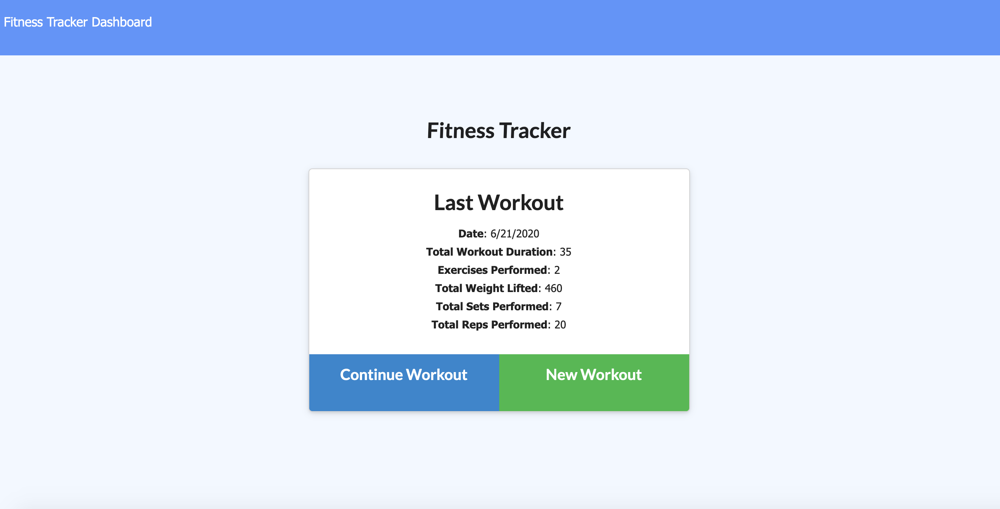

# Fitness Tracker

Keep track of all of your workouts with the FitnessTracker. Create workouts and add exercises to your workouts in order to keep accurate count of every pound you've lifted or mile you've run. 

## The Details

Fitness Tracker is a simple full-stack application built using node.js, express.js, mongoDB, and Mongoose. All of the workout data is stored in mongoDB and handled using mongoose.

## My Role

My main goal for this project was to set up the database models and utilize mongoose to handle the data. A majority of the front end code was provided for me. One of the more interesting things about this project is the use of virtual properties in the mongoose schema. Using a virtual (a property not stored in MongoDB) was a simple solution to dynamically add up the durations of all the exercises in a workout and display the total for the last workout shown on the main page. The code for this virtual is shown below.

## Usage

This app is deployed on heroku, however, it can also be ran locally. In order to use it locally, you'll need to download the code, run an npm install to get all of the proper node packages, and then run node server.js.

## Questions

If you have any questions about the repo or the app, open an issue or contact me directly at jason.vernot@gmail.com.